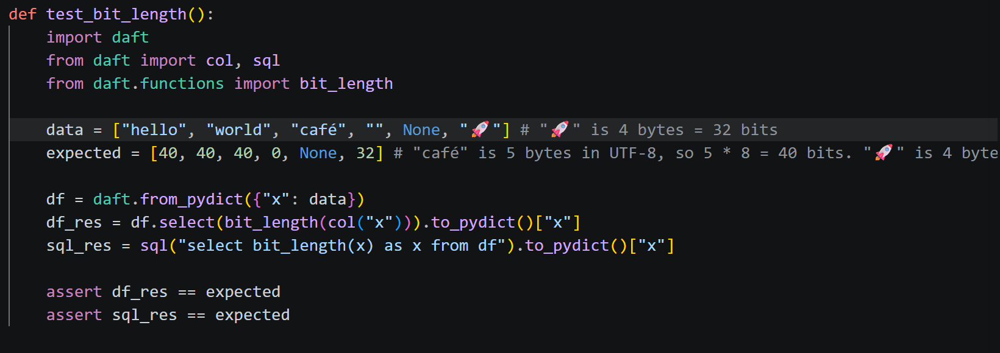
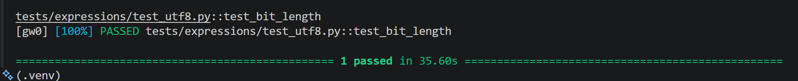

# Contribution [#3792]: [string expressions parity with pyspark]

**Contribution Number:** #3792
**Student:** Cesar Picazo
**Issue:** https://github.com/Eventual-Inc/Daft/issues/3792
**Status:** Phase IV

---

## Why I Chose This Issue

This issue caught my attention since it seemed like a great start to my open source journey. It is not too complicated and requires me to provide pre-existing string functions to the Daft repository. It also connects to my strengths which are the AI field, machine learning, data pipelines, and Python. Daft is related to Pandas in terms of helping with data manipulation and pipeline, which I have worked with quite a bit. Since I can now relate Daft to Pandas, it removes an extra roadblock of having to take a lot of extra time trying to understand the library, so I can try fast forward to the brainstorming, testing, and solution stage. 

---

## Understanding the Issue

### Problem Description

Daft has a string expression API, which are operations that can be applied to a column of strings in a DataFrame. However, there are a lot of missing expressions that exist in PySpark. PySpark is Spark's Python API, and it has a very mature, extensive set of string functions built up over years.

### Expected Behavior

We want to be able to use multiple string expressions in a Daft environment. If not, we would have to switch to Pandas or Spark to do the string work. The goal is to just use Daft for all expressions, and keep it simple for users when working with strings. 

### Current Behavior

Currently, users cannot do multiple existing string expressions when using the Daft library, which is known to be fast and efficient, and able to work with large datasets. Since multiple string expressions aren't implemented in Daft, users have to move to Pandas or another library to be able to make changes to column of strings.

### Who is affected?

Users who are working with large datasets, which Daft is known to do well with, will be affected largely. Users who want to migrate from another library into Daft would have to do extra work of adding extra code to deal with the fact that Daft doesn't deal with certain string expressions. The mission of Daft is to be fast, efficient, and user-friendly, so not including string expressions affects that. 

---

## Reproduction Process

### Environment Setup

Used the project's dev container with VS Code for production process, but Google Colab for reproduction to access the library. Only thing I had to do was download the library.

Getting the library set up was fairly easy:

```bash
pip install -U daft
```

Working Branch: [Branch](https://github.com/cpicazo8304/Daft/tree/feat/bit-length)

### Steps to Reproduce

1. Install and import Daft library
2. Create a DataFrame with string columns to test avaible and unavailable string functions
3. See which functions work and which don't because of their non-existence

### Reproduction Evidence

- **Commit showing reproduction:** [82194fd](https://github.com/cpicazo8304/su26-ai301-contribution/commit/82194fd7abed3dc251bd21005bc537927e17b35f)
- **My findings:** I discovered that the functions I want to work on, "bit_length" and "octet_length" don't exist in the library. So, I must add them in. 

---

## Solution Approach

### Notes / Analysis

- So, the main computation of a function takes place in Rust. So, the code to calculate the "bit_length" would have to be written in Rust.
- Anything done in Python will be utilizing the Expression class to construct a new Expression that contains the information from the string function.
- I have to touch four places: the Rust implementation (daft-functions-utf8/src/lib.rs), a Python function wrapper (daft/functions/*.py), the Expression class method (daft/expressions/expressions.py), and a test file (tests/expressions/).
    - The split exists because Daft exposes the same operation three ways (expression API, SQL, and method-style like .str.x()) — Rust is the single source of truth, and each Python entry point is just a thin call into the same registered function, so the logic isn't duplicated.

### Proposed Solution

Implement bit_length as a new Rust scalar UDF in daft-functions-utf8 directory, following the pattern of the existing length_bytes implementation, then expose it through Daft's Python expression API and validate correctness with unit and integration tests.

### Implementation Plan

Using UMPIRE framework (adapted):

**Understand:** String expressions such as bit_length are not part of the Daft library. This could make it tough for people to migrate into Daft. For people starting from Daft, it could lead to extra work by having to use other libraries for string columns, which is not efficient. I will be focusing on the bit_length function that counts the length of a string in terms of bits. 

**Match:** There are other string functions like translate, to_binary, etc. There are also numerical functions that are part of Spark but not Daft. In terms of solutions, there are string functions such as length_bytes and a normal length function. They have been implemented in Rust and Python in the repository. With my inexperience in Rust, they could help come up with a way to design the bit_length function. 

**Plan:** [Step-by-step implementation plan]
1. The first step is to create a new file under the directory, src/daft-functions-utf8/src. This is where the rust implementation of bit_length will exist. 
2. Complete the rust implementation for bit_length.
3. Add the new function to the Expression class (daft/expressions/expressions.py) and to the string functions file (daft/functions/str.py)
4. Test the rust and python implementations by adding a test to the test/expressions directory.

**Implement:** [Link to commits](https://github.com/cpicazo8304/Daft/tree/feat/bit-length)

**Review:** Will look at length_bytes function and how other functions have been implemented to make sure I have the correct structure.

**Evaluate:** I will evaluate in two ways: the test/expressions directory where I will add more own tests and by having a colab notebook in my local environment that will test the function's use.

---

## Testing Strategy

### Unit Tests

- [X] **Test case 1 (ASCII strings)**:
Basic single-byte characters where every character is exactly 1 byte = 8 bits. Input "hello" (5 bytes) should return 40. Sanity check that the core byte × 8 math is correct.
- [X] **Test case (Multi-byte UTF-8 characters)**:
Where bit_length diverges from character length. Input "café" should return 40 (5 bytes × 8), not 32 (4 chars × 8). Confirms bytes are being counted, not characters.
- [X] **Test case 3 (Null handling)**:
A column with None values mixed in — e.g. ["hello", None, "world"]. The null row should return None, not crash or return 0. Critical since the val? pattern in the implementation is specifically designed to propagate nulls.
- [X] **Test case 4 (Empty string)**:
Input "" should return 0. Edge case that is easy to accidentally break with off-by-one logic.
- [X] **Test case 5 (Emoji / 4-byte characters)**:
Input "🚀" should return 32 (4 bytes × 8). Confirms the full UTF-8 byte range works, not just 2-byte characters.

### Integration Tests

- [X] **Integration scenario 1 (DataFrame pipeline)**:
Create a Daft DataFrame with a string column, call bit_length via the expression API, collect results, and assert output column values match expected. Confirms the full Python → registry → Rust → result round-trip works end to end.

### Manual Testing

#### Process

I tested different types of strings: empty, null, emoji, text with accented chars, and normal text to check for different directions. I constructed a series with a string representing each of the ones I mentioned. 

Here is the test function:



#### Results

I was able to get the correct resulting Series/expression after running the bit_length function on the column containing the different types of strings.

Here are the results:




---

## Implementation Notes

### Week [1] Progress (June 22 - 28)

**What I built:**
- Didn't build much this week, but instead spent the week understanding Rust to better understand how string functions are implemented in Daft.

**Challenges faced:**
- I had not worked with Rust before. I have been purely a Python person with some Java, JavaScript, C, and HTML experience.
  - It was difficult understanding the way types and declarations worked (mutable variables, etc.).

**Commits this week:**
- No commits this week.

### Week [2] Progress (June 29 - July 5)

**What I built:**
- Analyzed the files of Daft, specifically the length_bytes rust implementation and analyzed the libraries and structs used.
- Added the bit_length implementation
- Added the bit_length call in daft/functions/str.py and daft/expressions/expressions.py

**Challenges faced:**
- Initially, I couldn't understand how the Rust implementations worked in correspondence with the Python code.
   - Understanding Rust more helped notice the structure helped bring me up to speed.

**Commits this week:**
- 98f7050: added bit_length function. Similar to length_bytes but with times 8 and different names.
- 2f3abf3: Added function to expression and functions files in addition to adding tests (Next thing is to test out the function)

Analyzed the files of Daft, specifically the length_bytes rust implementation and analyzed the libraries and structs used. This helped me write the bit_length function (src/daft-functions-utf8/src/bit_length.rs), which was nearly the same.

You can see the implementation here: [Link to implementation](https://github.com/cpicazo8304/su26-ai301-contribution/blob/main/implementations/bit_length.rs)

### Week [3] Progress (July 6 - 12)

**What I built:**
- Added in the bit_length function into the __init__.py file under daft/functions
- Added in the test function to test the completed function.
  - Function contains a Series of [normal word, normal word, word with accented letter, empty string, None, emoji]
- All existing tests passed (ran full test suite)

**Challenges faced:**
- Initially, I couldn't run the test function because of not having the make cmd line.
- Spent 3 hours debugging before realizing I needed more storage so I redirected the make .venv and make build to my SD card that contains a lot more storage. Also, put the repository files into the SD card, so I won't have to worry about storage.
- Also, there times that I required to call some commands to add in args to run the tests that took me a bit to figure out.

**Commits this week:**
- 2b2de17: feat(string expr): Added bit_length to __init__.py so it can be used.
- e93af31: chore: gitignore Windows build artifacts (.pyd, .pdb)

### Code Changes

- **Files modified:** bit_length.rs (added to src/daft-functions-utf8/src directory), daft/expressions/expressions.py, daft/functions/str.py, tests/expressions/test_utf8.py, daft/functions/__init__.py
- **Key commits:** 98f7050, 2f3abf3, 2b2de17, e93af31
- **Approach decisions:** I modeled bit_length after length_bytes because they work the same. Bit length is just 8 * length_bytes. Also, the functions have a structure that I must follow when adding it in: add call in str.py, expressions.py, and __init__.py.

---

## Pull Request

**PR Link:** [PR Link](https://github.com/Eventual-Inc/Daft/pull/7263)

**PR Description:** 

What does this PR do?: Adds the bit_length(col)  function for Daft's UTF8/string expressions.

Why was this PR needed?: Issue #3792 reported that there were missing string expressions that exists in Spark but not in Daft. Not required to do all the functions, but I was able to implement the bit_length function.

What are the relevant issue numbers?: Checks off a function in #3792.

Does this PR meet the acceptance criteria?:
[x] Tests added for new behavior
[x] All tests passing
[x] No breaking changes

**Maintainer Feedback:**
- [July 13]: The AI bot that checks pull requests (Greptile) give me a confidence score of 5/5 and said my PR request is safe to merge. Currently, awaiting checks on my code.
- [July 13]: After checks, I failed a test checking style (spacing, blank lines, etc.).
- [July 13]: I ran a couple of cmds such as `cargo clean` and `venv\Scripts\pre-commit run --all-files` that cleaned up the files I edited. Afer that, I passed all the checks.

**Status:** Awaiting Review 

---

## Learnings & Reflections

### Technical Skills Gained

Technically, I learned how to efficiently move through the code base, how to use make cmd, how to use Git Bash, how to code in Rust (beginner level), and how to use the git commands. 

### Challenges Overcome

It was difficult understanding Rust from someone who is better at Python. It is a low-level language that works differently from Python. It also takes up space in my laptop, and is organized in a unique way (cargo.tml, src folder, mod.rs, lib.rs). I had to look through documentation, watch a beginner video, and, more importantly, look at the structure of Rust in action in the Daft repository that helped bring me up to speed about how Rust works and how it is implemented in the code.

### What I'd Do Differently Next Time

Next time, I will definitely name my commits a bit better. I will also look only at relevant files, rather spend more time understanding a large portion of the codebase. I can look through where things I defined, but honestly, I didn't have to for this contribution.

---

## Resources Used

- [Rust Documentation](https://doc.rust-lang.org/stable/std/index.html)
- [Rust Full Course](https://www.youtube.com/watch?v=rQ_J9WH6CGk)
